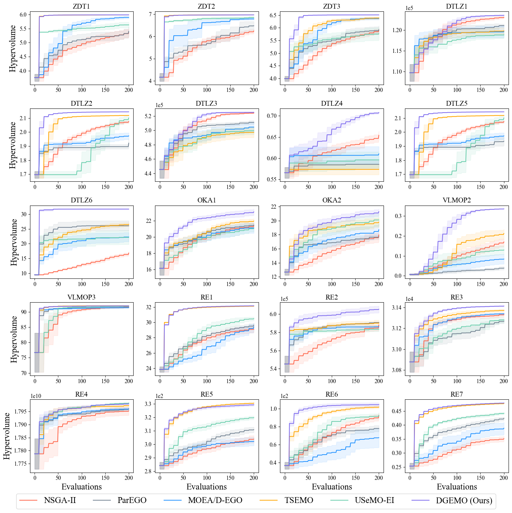

# Diversity-Guided Efficient Multi-Objective Optimization (DGEMO)


**Diversity-Guided Multi-Objective Bayesian Optimization With Batch Evaluations**

[Mina Konaković Luković](http://people.csail.mit.edu/mina/)\*, [Yunsheng Tian](https://www.yunshengtian.com/)\*, [Wojciech Matusik](http://people.csail.mit.edu/wojciech/)

*Thirty-fourth Conference on Neural Information Processing Systems (NeurIPS 2020)*

[[Paper]](https://www.yunshengtian.com/files/20-nips-dgemo/DGEMO.pdf) [[Supplementary]](https://www.yunshengtian.com/files/20-nips-dgemo/DGEMO_supplementary.pdf) [[Poster]](https://www.yunshengtian.com/files/20-nips-dgemo/DGEMO_poster.pdf) [[Video]](https://youtu.be/dwEPBr2kLaQ)

## Overview

This repository contains Python implementation of the algorithm framework for multi-objective Bayesian optimization, including the official implementation of DGEMO and re-implementations of other popular MOBO algorithms.

**News (02/2023)**: We have added [instructions](#custom-problem-setup) on how to set up your custom problem in this code repository for optimization.

## Key Features

- **Algorithm**: Support DGEMO, TSEMO, USeMO-EI, MOEA/D-EGO, ParEGO, NSGA-II and custom algorithms. See *mobo/algorithms.py* to select proper algorithm to use / define your own algorithm.
- **Test problem**: Support: ZDT1-3, DTLZ1-6, OKA1-2, VLMOP2-3, RE. Also constraint handling is implemented, if the problem constraints are properly defined according to [Pymoo Problem Definition](https://pymoo.org/problems/custom.html) (see the "G" functions).
- **Surrogate model**: Support Gaussian process as surrogate model to evaluate samples, or sampled functions by Thompson Sampling from the fitted Gaussian process. See *mobo/surrogate_model/*.
- **Acquisition function**: Support PI, EI, UCB and identity function as acquisition, see *mobo/acquisition.py*.
- **Solver**: Support using NSGA-II, MOEA/D and ParetoDiscovery [[Schulz et al. 2018]](https://dl.acm.org/doi/10.1145/3197517.3201385) to solve the multi-objective surrogate problem. See *mobo/solver/*.
- **Selection**: Support: HVI, uncertainty, random, etc. as criterion for selecting next (batch of) samples to evaluate on the real problem. See *mobo/selection.py*.

For DGEMO, we use Gaussian process as surrogate model, identity function as acquisition function, ParetoDiscovery as multi-objective solver and our diversity-guided selection algorithm.

## Code Structure

```
baselines/ --- MOO baseline algorithms: NSGA-II
mobo/
 ├── solver/ --- multi-objective solvers
 ├── surrogate_model/ --- surrogate models
 ├── acquisition.py --- acquisition functions
 ├── algorithms.py --- high-level algorithm specifications
 ├── factory.py --- factory for importing different algorithm components
 ├── mobo.py --- main pipeline of multi-objective bayesian optimziation
 ├── selection.py --- selection methods for new samples
 ├── surrogate_problem.py --- multi-objective surrogate problem
 ├── transformation.py --- normalizations on data
 └── utils.py --- utility functions
problems/ --- multi-objective problem definitions
scripts/ --- scripts for batch experiments
visualization/ --- performance visualization
main.py --- main execution file for MOBO algorithms
```

## Requirements

- Python version: tested in Python 3.7.7

- Operating system: tested in Ubuntu 18.04

- Install the environment by [conda](https://www.anaconda.com/) and activate:

  ```
  conda env create -f environment.yml
  conda activate mobo
  ```

  Install another package by pip (which is used by DGEMO):

  ```
  pip install pygco
  ```

- If the pip installed pymoo is not compiled (will raise warning when running the code), you can clone the pymoo github repository, compile and install this module as described [here](https://pymoo.org/installation.html#development), to gain extra speed-up compared to uncompiled version.

## Getting Started

### Basic usage

Run the main file with python with specified arguments:

```
python main.py --problem dtlz1 --n-var 6 --n-obj 2 --n-iter 20
```

If you don't understand the meaning of the arguments, please see *arguments.py*.

### Parallel experiment

Run the script file with python, for example:

```
python scripts/run.py --problem dtlz1 zdt1 --algo dgemo parego --n-seed 10 --n-process 8
```

This will run algorithm DGEMO and ParEGO on DTLZ1 and ZDT1 problems, with 10 different random seeds. So in total there'll be 2 * 2 * 10 = 40 different experiments. Since we specified 8 parallel processes to use, these 40 experiments will then be distributed to 8 processes to run in order. Whenever a process finishes its current experiment will be filled by another experiment that hasn't been run.

## Performance



To reproduce this result, run the following command:

```
python scripts/run.py --algo nsga2 parego moead-ego tsemo usemo-ei dgemo --problem zdt1 zdt2 zdt3 dtlz1 dtlz2 dtlz3 dtlz4 dtlz5 dtlz6 oka1 oka2 vlmop2 vlmop3 re1 re2 re3 re4 re5 re6 re7 --batch-size 10 --n-iter 20 --n-seed 10
```

This command produces the results on all problems using all algorithms with 10 different random seeds. In total there are 20 * 6 * 10 = 1200 individual experiments, with 20 iterations in each experiment, which could probably take hours or days to finish, depending on the hardware configurations and parallelization level. See Appendix C.2 in our paper for runtime (speed) statistics of different algorithms and our hardware platform for producing that statistics.

To visualize this figure, run the following command:

```
python visualization/visualize_hv_all.py
```

## Result

The optimization results are saved in csv format and the arguments are saved as a yaml file. They are stored under the folder:

```
result/{problem}/{subfolder}/{algo}-{exp-name}/{seed}/
```

By default the *subfolder* name is 'default'. If no experiment name (*exp-name*, which is used to distinguish between experiments using same problem and same algorithm but has other different detailed parameters) specified, then the folder would be:

```
result/{problem}/{subfolder}/{algo}/{seed}/
```

Then, under that folder, the name of csv files would be:

```
(EvaluatedSamples/ParetoFrontEvaluated/ParetoFrontApproximation).csv
```

The name of the argument yaml file is `args.yml`.

*Explanation --- problem: problem name, algo: algorithm name, exp-name: experiment name, seed: random seed used*

## Visualization

For batch visualization of hypervolume curve produced from multiple experiments, run for example:

```
python visualization/visualize_hv_batch.py --problem zdt1 --algo dgemo --n-seed 10
```

This command will produce a figure of a hypervolume curve from experiments ran on ZDT1 problem, using DGEMO as algorithm, averaged across 10 random seeds. 

The batch visualization is also compatible with multiple algorithms for plotting multiple hypervolume curves on a single figure for comparison. Also it can produce multiple figures for multiple problems at the same time, for example:

```
python visualization/visualize_hv_batch.py --problem zdt1 zdt2 zdt3 --algo dgemo tsemo parego --n-seed 10
```

This command will produce 3 figures for ZDT1, ZDT2 and ZDT3 problems respectively. In each figure, there are three hypervolume curves from experiments using DGEMO, TSEMO and ParEGO respectively, averaged across 10 random seeds.

Note if you don't specify `--problem` or `--algo` arguments, it will automatically find all the problems or algorithms you have in the result folder.

## Custom Problem Setup

If you are interested in trying DGEMO for your own problems, here are the necessary steps:

- First, to define your custom problem, here is a basic template assuming you put this file as `problems/myproblem.py`.  Here in `__init__()`, we set 3 design variables (`n_var`), 2 objectives (`n_obj`), 0 constraints (`n_constr`), the lower bound of the design variables as 0 (`xl`) and upper bound as 1 (`xu`). Next, the objective evaluation function is defined as `_evaluate_F()`, where the argument `x` is a batch of design variables. As a simple example, we define the first objective as the first design variable, and the second objective as the second design variable subtracting the third design variable. 

```python
import numpy as np
from .problem import Problem

class MyProblem(Problem):
  
  	def __init__(self):
      	super().__init__(n_var=3, n_obj=2, n_constr=0, xl=0, xu=1)
        
    def _evaluate_F(self, x):
      	x1, x2, x3 = x[:, 0], x[:, 1], x[:, 2]
        f1 = x1
        f2 = x2 - x3
        return np.column_stack([f1, f2])
```

- Add the following line to `problems/__init__.py`:

```python
from problems.myproblem import MyProblem
```

- Append a tuple `('myproblem', MyProblem)` to the `problems` variable in `get_problem_options()` in `problems/common.py` such that our problem is callable from command line arguments.
- To run optimization on the custom problem, run `main.py` with `--problem myproblem` and other necessary arguments.

For more examples of predefined optimization problems, please refer to `problems/`.

## Citation

If you find our repository helpful to your research, please cite our paper:

```
@article{konakovic2020diversity,
  title={Diversity-Guided Multi-Objective Bayesian Optimization With Batch Evaluations},
  author={Konakovic Lukovic, Mina and Tian, Yunsheng and Matusik, Wojciech},
  journal={Advances in Neural Information Processing Systems},
  volume={33},
  year={2020}
}
```
